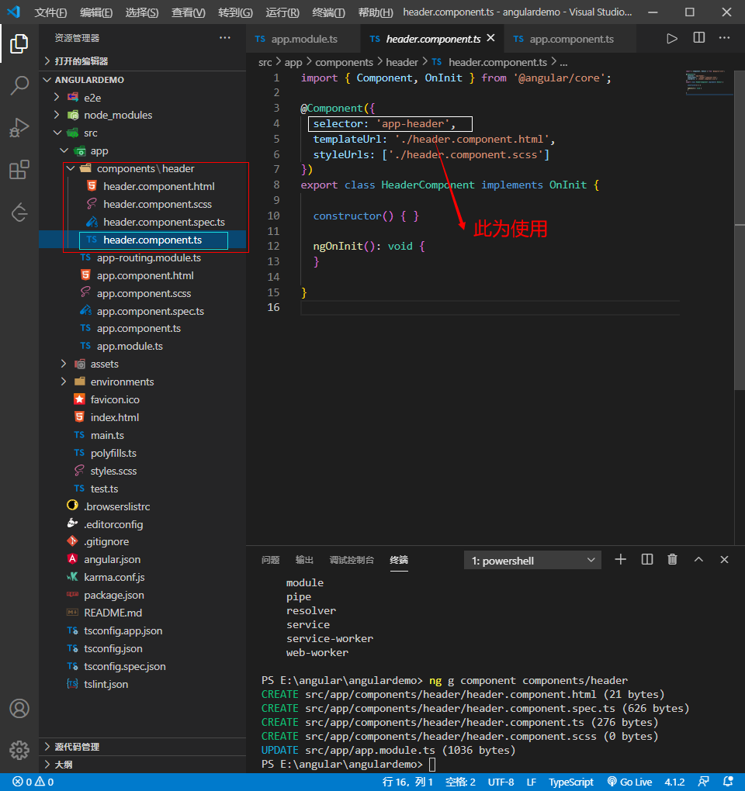

# 目录结构分析


```js


/* 
src 主开发项目文件夹
    app 存放组件及根模块的文件夹
    assets 静态资源文件夹
    browserslist 支持浏览器配置的文件  例如想支持IE9-11 将not IE 9-11 改成 IE9-11
    index.html 入口文件
    main.ts整个项目入口文件
    polyfills 填充库文件
 */
```


### 自定义组件

https://cli.angular.io/

创建组件:

<!-- 指定目录components并创建header 这时就会在app文件夹下多个components文件夹 -->
>ng g component components/header  

```
当你想要创建组件时 可以输入ng g看想要安装的组件都有什么
```

### 组件使用 (一般通过命令安装这步是创建好的)
在app.module.ts引用 并且配置到declarations
```js
import { HeaderComponent } from './components/header/header.component';

 declarations: [//配置当前项目运行的组件
    AppComponent, HeaderComponent
  ],
```

### 使用方法

根据创建的找到文件夹.component.ts 查看使用方法
如图



