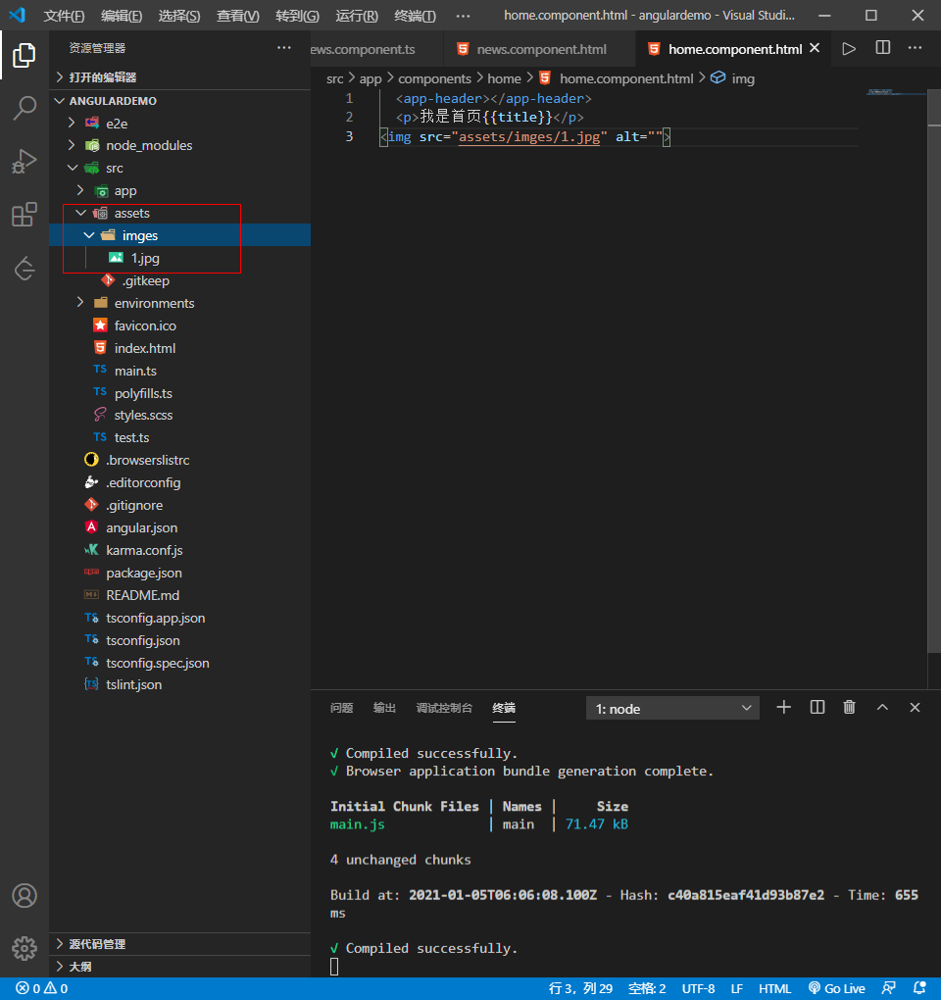
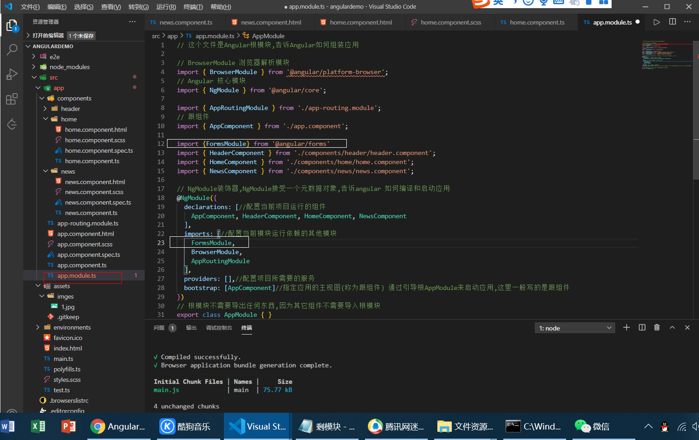

## 定义变量方法

```js
export class HomeComponent implements OnInit {

  title = '我是首页组件'//定义变量
//   public title = '我是首页组件'//也可以这样定义变量 因为前面什么不加默认就是public
  constructor() { }

  ngOnInit(): void {
  }

}


// html中只需要
  <p>我是首页{{title}}</p>

```

## 规定类型

为了严谨我们要在定义变量的时候规定类型

```js
export class NewsComponent implements OnInit {

  constructor() { }
  public msg = '新闻组件'

  username:string = '张三'
  
  public student:any = '我是一个学生的属性'
  ngOnInit(): void {
  }

}


/* 
声明变量属性的几种方式

public 共有(默认) 可以在这个类里面使用,也可以在类外面使用

protected 保护类型  他只有在当前类和它的子类里面可以访问

private 私有   只有在当前类才可以访问这个属性

 */
```

## 循环  *ngFor
```js

export class NewsComponent implements OnInit {

  constructor() { }
  public items: Array<any> = [1, 'xiaoMing', 11]
  public dataList: string[] = ['111', '222', '333']

  ngOnInit(): void {
  }


  // html中

<div
*ngFor="let item of dataList"
>
{{item}}
</div>
```

## 导入图片

我们先建一个imges文件夹在assets中用于存放图片



在我们导入的时候可以直接

```js


```

- 当我们要引用网络图片时

```js

export class HomeComponent implements OnInit {

  title = '我是首页组件'
  constructor() { }
  public src = 'https://ss1.bdstatic.com/70cFvXSh_Q1YnxGkpoWK1HF6hhy/it/u=1345876676,54119291&fm=15&gp=0.jpg'
  ngOnInit(): void {
  }
}
  // html中


```


## 显示索引值

```js
export class HomeComponent implements OnInit {
 public list:any = [
    {
      name:'新闻'
    },
    {
      name:'新闻'
    },
    {
      name:'新闻'
    }
  ]
  ngOnInit(): void {
  }
}
 
  // html中  这里let key = index画重点
<div *ngFor="let item of list;let key = index">/
  {{key + item.name}}
</div>
```

## 条件判断语句 *ngif

```js
export class HomeComponent implements OnInit {
  public bool:boolean = true
  ngOnInit(): void {
  }
}

  // html中  
<div *ngIf="bool">
1111
</div>
```

## 条件判断语句 *[ngSwitch]

<span [ngSwitch]="num">
<p *ngSwitchCase="1">
是
</p>
<p *ngSwitchCase="2">
否
</p>
<p *ngSwitchDefault>

</p>
</span>

## 属性[ngClass],[ngStyle]

- ngClass
  
<div [ngClass]="{'red': boo,'blue':bool}">
  q123123213123
</div>

```js
export class HomeComponent implements OnInit {
  public bool:boolean = true
  ngOnInit(): void {
  }
}
```

   高级写法
<div *ngFor="let item of list;let key = index" [ngClass]="{'red': key==1,'blue':key==2}">
  {{key + item.name}}
</div>

- ngStyle
  + 写法1  普通写法
  <div [ngStyle]="{'background': 'red'}">11111111111111111</div>

  + 写法2  变量写法 color为自定义变量
  <div [ngStyle]="{'background': color}">11111111111111111</div>

## 管道

- 内置方法
http://bbs.itying.com/topic/5bf519657e9f5911d41f2a34

```js
  public today = new Date()
```
<div>{{today | date:'yyyy-MM-dd HH:mm:ss'}}</div>


## 事件

- 点击事件
<button (click)='run()'>执行事件</button>
<button (click)='handleClick()'>执行事件获取数据</button>
<button (click)='handleClick1()'>执行事件改变数据</button>

```js
  run(){
    console.log('点击');
  }
  handleClick(){
    alert(this.title)
  }
  handleClick1(){
    this.title = '1111111111111'
  }
```

- 键盘事件

比如我们要监听用户是否按下回车
<h2>键盘抬起</h2>
<input type="text" (keyup)='keyUp($event)'>

```js
  keyUp(e:any) {
    console.log(e);
    if (e.keyCode ==13) {
      console.log('点击了回车');
      console.log(e.target.value);
      
    }
  }
```

## 双向数据绑定 只是针对表单

在app.module.ts中引入FormsModule，并且在imports中声明



<input type="text" [(ngModel)]="myinput">

{{myinput}}


## 隐藏当前数据[hidden]

由于*ngFor与*ngIf不能同时使用，可使用hidden，表示满足条件隐藏当前数据

